# Lab05 - Deploy

[TOC]

## Due Date

Week 5 Saturday 10:00 pm AEST

## Note

1. It is possible to complete this lab without finishing `lab05_forum` - you can simply deploy the starter code in `lab05_forum`, as the only routes we will assess are the root (`/`) and echo (`/echo/echo`). However, you should still clone and install the necessary packages as per the instructions in `lab05_forum` before attempting `lab05_deploy`.

1. Although it is not a requirement that you deploy to alwaysdata in this lab, we recommend doing so as you will receive the most support from our staff this way.

## Background

### Rationale

Deploy deploy deploy 🚀!

While having our forum application working locally is fun and all, there's no point if you can't show it off to everyone else 😎!

In this lab, you will expose your backend server application to the outside world. You can use it to chat with your friends, host secret parties or plot a coup d'etat against COMP1531 staff - the possibilities are endless!

### Getting Started

- Copy the SSH clone link from Gitlab and clone this repository on either VLAB or your local machine.
- In your terminal, change your directory (using the cd command) into the newly cloned lab.

### Package Installation

1. Open [package.json](package.json) and look at existing packages in "dependencies" and "devDependencies". Install them with:
    ```shell
    $ npm install
    ```

1. Use `git` to `add`, `commit` and `push` your [package.json](package.json) and [package-lock.json](package-lock.json).
    
1. That's it :). This repository (`lab05_deploy`) is **only for submitting your `DEPLOYED_URL` and sanity-checking with the given tests and pipeline**. Most of the work (i.e. the deployment process) **should be done in your `lab05_forum` repository**.

## Task

An image guide is available for some of the instructions below. You can toggle their visibility by clicking on the respective text - for example:

<details close>
<summary>Click this line of text to toggle image visibility</summary>

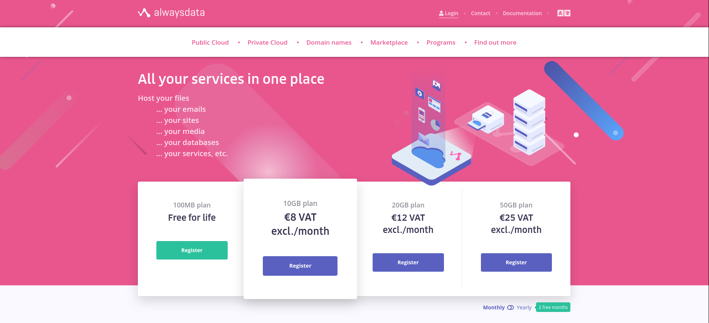

</details>

Additionally, a video demonstration of the deploying process is available here:
- https://www.youtube.com/watch?v=TgVzcMc-aMw

Make sure to also read the tips given by alwaysdata as you progress through the lab. **Don't just blindly follow the instructions given**, as there will be inputs that you will need to modify accordingly for your needs.

### alwaysdata Registration

Visit https://admin.alwaysdata.com/register and create a new alwaysdata account (use any valid email address).

Upon registration, you will be prompted to enter a `Name` that determines the address of your sites, which can be anything you want (although avoid using your zID in the `Name` here - this will come later) - in this guide, we will be using the name `"anythingyouwant"`.

A few things to note:

1. alwaysdata policy only allows one free account per user, so avoid registering more than once (i.e. don't make another account for your major project) as you may risk having all your accounts suspended. It is possible to host more than one site per account by appending a different path to the base URL.
1. You should **NOT** need a credit card to create a free account, although you may be prompted to enter one due to either your location or IP address. If this is the case, we recommend you instead create an alwaysdata account using Firefox inside VLAB (either by [downloading tigervnc](https://taggi.cse.unsw.edu.au/Vlab/) or through the [browser link](https://vlabgateway.cse.unsw.edu.au/)).
    <details close>
    <summary>VLAB Firefox alwaysdata Registration Image Guide</summary>

    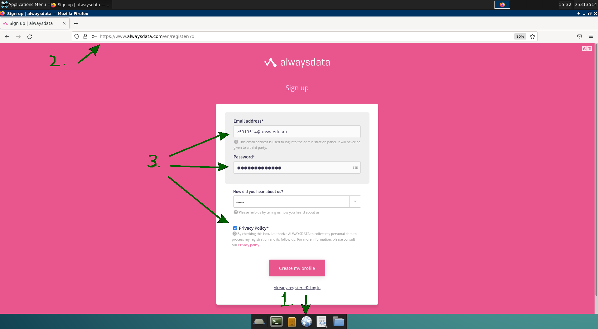

    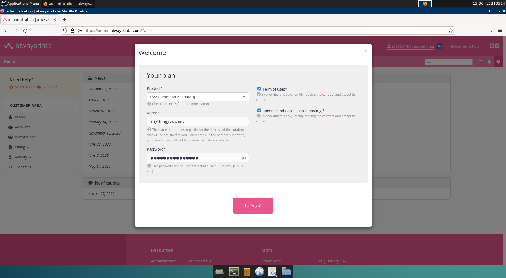

    </details>
    
### Creating a new site
    
#### Deleting Existing Default Site

1. On the left sidebar, navigate to `Web` -> `Sites`.
1. Delete the default PHP site.
    <details close>
    <summary>Web -> Sites -> Delete PHP Image Guide</summary>

    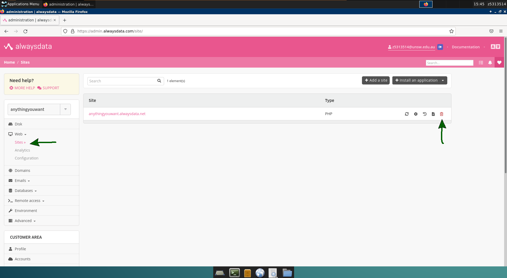

    </details>

#### Installing an Express.js Application

1. Click on `Install an application`.

    <details close>
    <summary>Install an Application Image Guide</summary>

    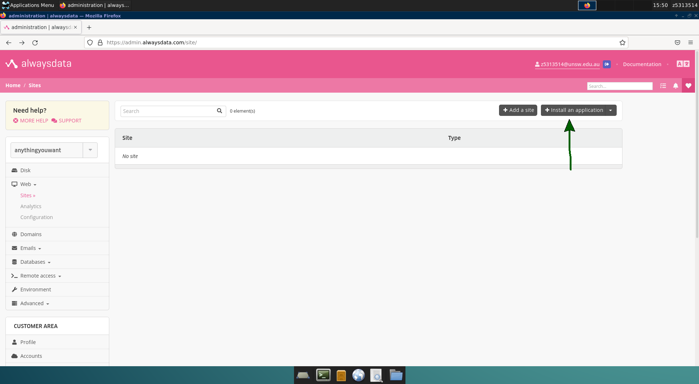

    </details>

1. Select
    - Categories: `Framework`
    - Languages: `NodeJS`
    
    and click on `Express.js`.

    <details close>
    <summary>Framework NodeJS Express.js Image Guide</summary>

    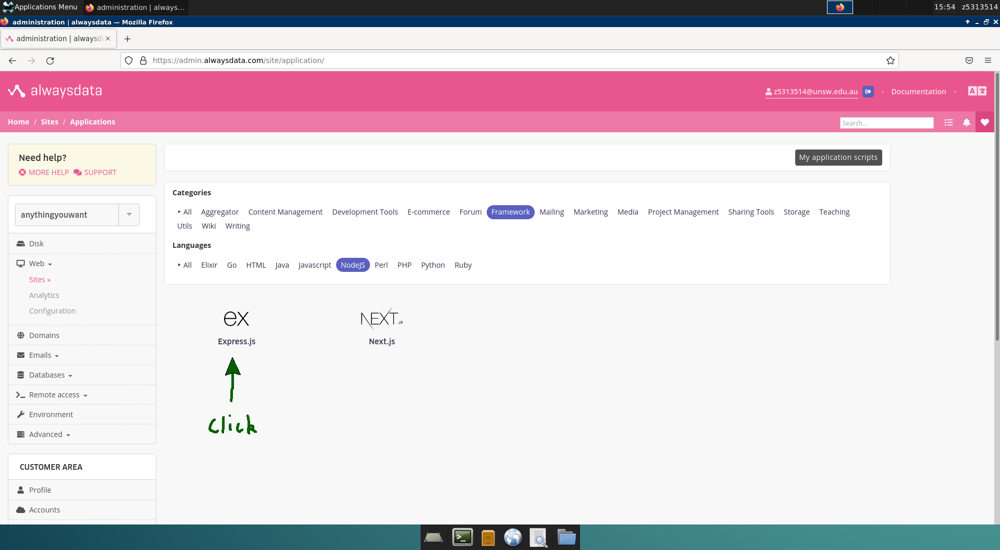

    </details>

1. Under `Addresses` and above the input box, find the line that says 
    > ... The following subdomains belong to you and are currently unused : [SOME_ALWAYSDATA_ADDRESS_TO_COPY]
    
    copy the unused subdomain and paste it into the input box. Append the URL with a path of your choice for your application name, although it **must contain your zID**. For example, if the unused subdomain is
    ```
    anythingyouwant.alwaysdata.net
    ```
    you should have something like (replace with **your zID**)
    ```
    anythingyouwant.alwaysdata.net/z5555555-forum
    ```
    as the address for your forum application.

1. Under `Installation`, use the installation directory
    ```
    /www/cs1531forum
    ```

    <details close>
    <summary>Brief Site Configuration Image Guide</summary>

    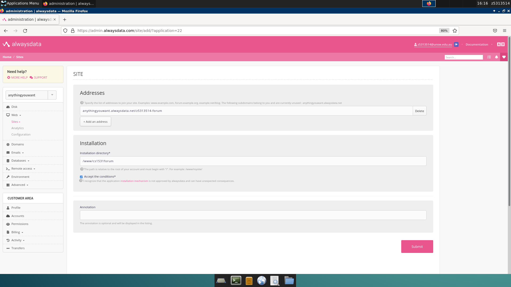

    </details>

### Site Configurations

1. Head back to Web -> Sites and select the `Edit` (Settings) Icon

    <details close>
    <summary>Web -> Sites -> Edit Image Guide</summary>

    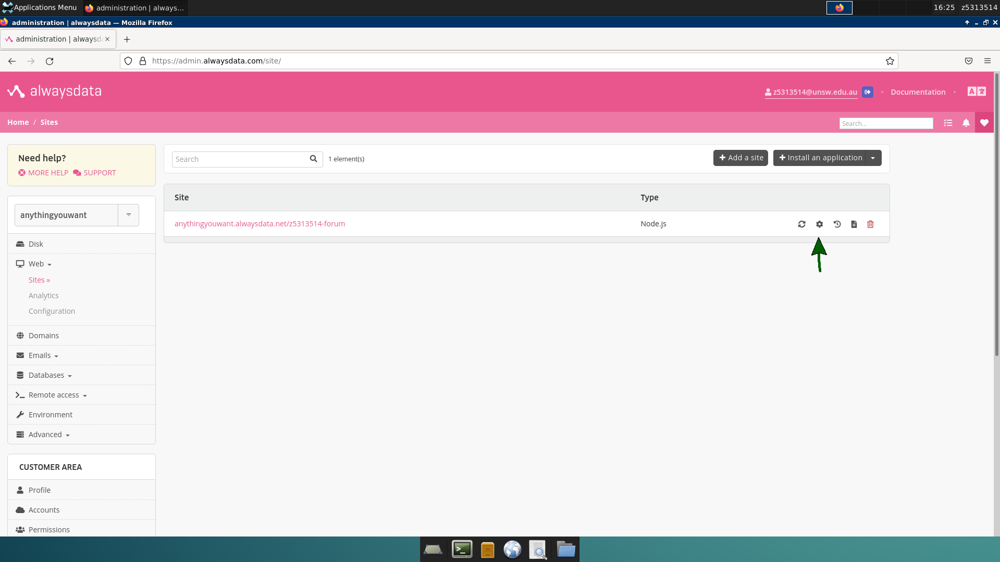

    </details>
    
1. The only two changes left to make are:
    - `Configuration` -> `Command`:
        ```
        npm run ts-node src/server
        ```

    - `Configuration` -> `Node.js version`:
        ```
        16.14.2
        ```

    <details close>
    <summary>Full Site Configuration Image Guide</summary>

    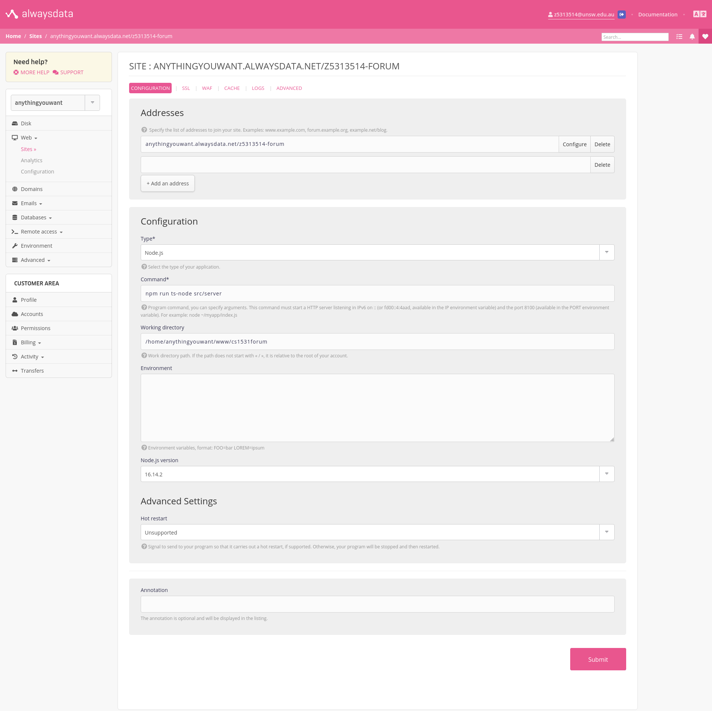

    </details>

1. Click Submit.

### Enabling SSH Access

1. On the left sidebar, navigate to `Remote Access` -> `SSH`.
1. Click on the `Edit` (Settings) icon for the single entry present

    <details close>
    <summary>SSH Edit Image Guide</summary>

    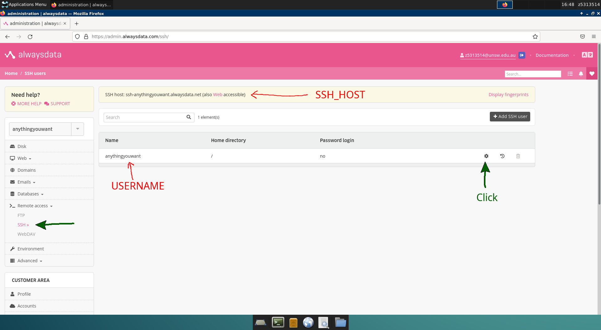

    </details>

1. You can enter a different password for SSH if you wish, otherwise, leave it blank to use the same one as your alwaysdata account.

1. Tick `Enable password login` and click `Submit`.
    <details close>
    <summary>SSH Configurations Image Guide</summary>

    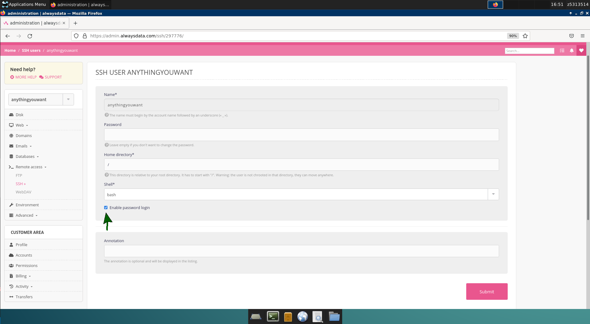

    </details>

### Deploying to alwaysdata

A reminder that you should be deploying from lab05_forum's repository, **not** lab05_deploy.

For the upcoming steps, we will assume that the `SSH_HOST` is `ssh-anythingyouwant.alwaysdata.net` and `USERNAME` is `anythingyouwant`. You should **replace these values as appropriate**.

1. To avoid having to enter your password multiple times when deploying, we will use the command `ssh-copy-id`. You should have already generated an ED25519 SSH key from lab01_git, although feel free to revisit that lab if this is not the case. The command will be of the form:
    ```shell
    $ ssh-copy-id USERNAME@SSH_HOST
    ```
    For example, using the credentials in this guide (you should modify them as appropriate):
    ```shell
    $ ssh-copy-id anythingyouwant@ssh-anythingyouwant.alwaysdata.net
    ```
    Type "yes" if you are prompted with `"Are you sure you want to continue connecting (yes/no/[fingerprint])?"`, and enter your SSH password when required.

1. Open the `deploy.sh` file in your lab05_forum and modify the `USERNAME` and `SSH_HOST` as appropriate. Once this is done, deploy your application with the command: 
    ```shell
    $ bash deploy.sh
    ```

    If you are successful, you should be able to see the correct message when visiting your backend server's root URL in the browser.

    <details close>
    <summary>Successful Deployment Image</summary>

    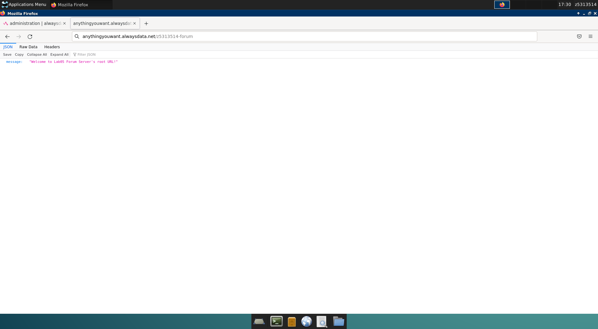

    </details>
    
### Troubleshooting Errors

#### Helloworld Text

<details close>
<summary>Helloworld Error Image</summary>

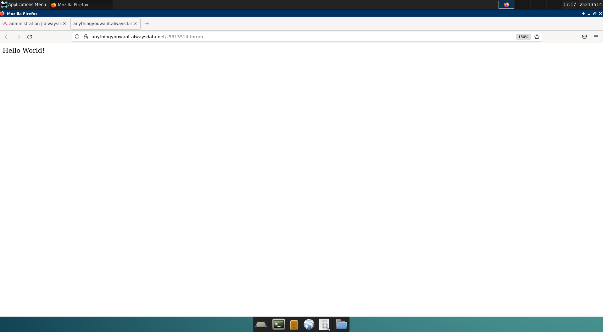

</details>

If you see the text 'Helloworld' when visiting your deployed URL, it is likely either:

1. Your alwaysdata configuration "start" command is incorrect. Check that you have
    ```
    npm run ts-node src/server
    ```
    in your site configurations for `Command`.

1. Your working directory may not be consistent between the `deploy.sh` file and `alwaysdata`. Ensure that they match.

#### Connection to upstream failed: connection failure

<details close>
<summary>Connection to Upstream Failed Error Image</summary>

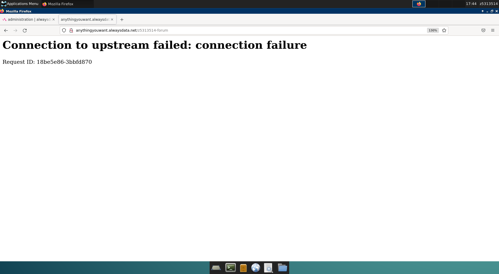

</details>

This error occurs when your server crashes on startup. There are two main ways to find the reason for the crash:

1. Navigate to Web -> Sites on the left sidebar, then click on the Logs icon (left of the red bin icon).

    <details close>
    <summary>Always Data Site Example Logs Images</summary>

    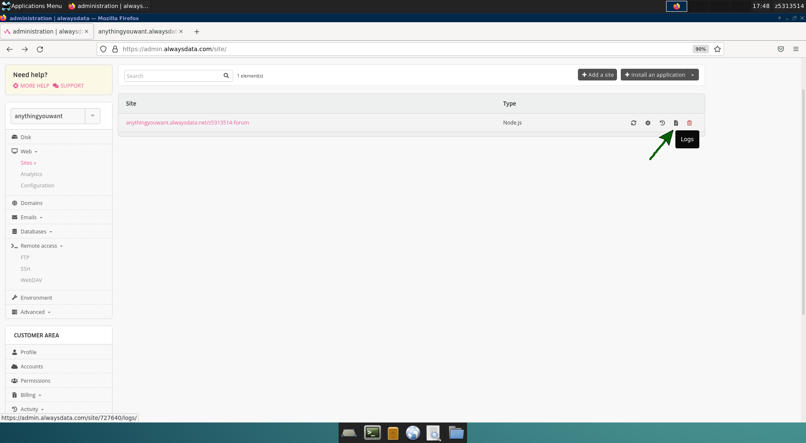

    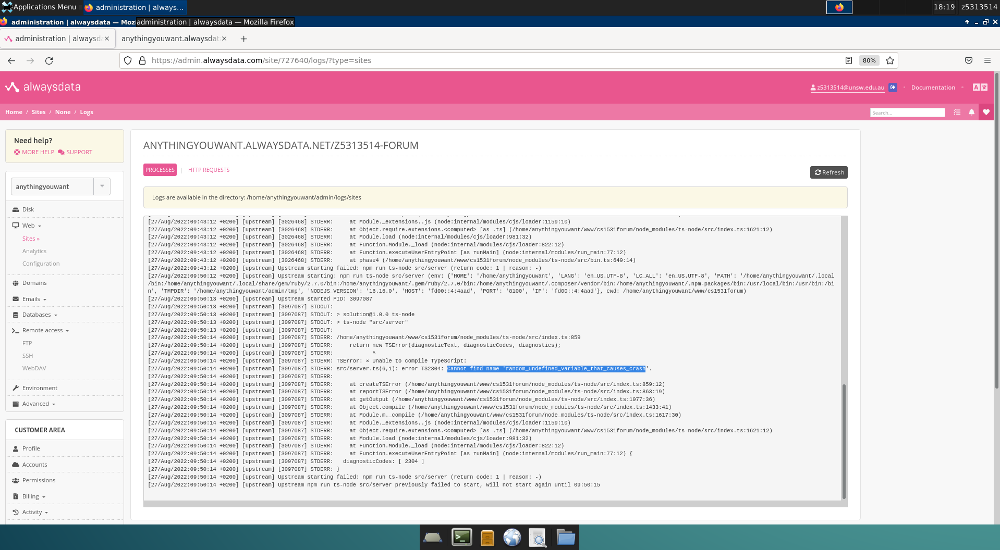

    </details>

1. SSH into the alwaysdata server using your credentials (replace the SSH command with your `USERNAME@SSH_HOST` as appropriate). Change to the appropriate `WORKING_DIRECTORY` and debug the crash by temporarily starting the server manually:
    ```shell
    $ ssh anythingyouwant@ssh-anythingyouwant.alwaysdata.net
    $ cd ~/www/cs1531forum
    $ npm run ts-node src/server
    ```

    <details close>
    <summary>SSH Example Crash Images</summary>

    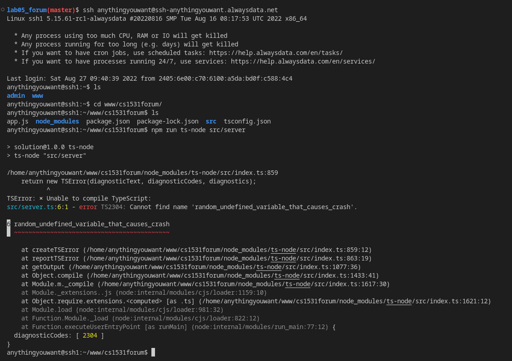

    </details>
    
Make the necessary modifications to your code locally to fix the crash, then redeploy the server with the command:
```sh
$ bash deploy.sh
```
Restart the site on alwaysdata and repeat the process until the server is started successfully.

##### Other Common Deployment Errors 

If your server can both run locally *and* when you `SSH` into `alwaysdata`
but still results in "Connection to upstream failed" when accessing the deployed site, here are some common issues to look into:

1. Not having `ts-node` in (only) the list of `dependencies` in your [package.json](package.json):
    - This package is necessary to start the server
    - Another common issue is having `ts-node` in both `dependencies` *and* `devDependencies`- it should only be in `dependencies`.

1. Specifying `localhost` or `127.0.0.1` as the `HOST`/`IP` when starting the server. For example, rather than
    ```js
    const server = app.listen(PORT, () => { // ✅
    ```
    you have:
    ```js
    const server = app.listen(PORT, '127.0.0.1', () => { // ❌ 
    ```
    To resolve this for deployment, either remove the `HOST`/`IP` argument or use `process.env.IP` and supply an `IP` environment variable when working locally.

### Testing and Submitting your DEPLOYED_URL

To submit your deploy URL, `cd` back into the `lab05_deploy` repository.

1. Open [src/deploy.ts](src/deploy.ts) and modify the `DEPLOYED_URL` to your newly deployed site, e.g. https://anythingyouwant.alwaysdata.net/z5555555-forum. A reminder that the `DEPLOYED_URL` must contain your zID exactly once.

1. Open [src/deploy.test.ts](src/deploy.test.ts) and uncomment the given tests. Ensure that the tests pass locally.

1. Push your code and the uncommented tests to your master branch. Your Gitlab pipeline should also pass.

1. As an optional final check, try connecting the [frontend](https://comp1531frontend.gitlab.io/forum) to your deployed backend application.

### Tip

1. Before seeking help, make sure to re-check all the debugging/troubleshooting tips provided.
1. When posting on our COMP1531 Ed forums for support, please include screenshots of:
    - The output when you `ssh` into alwaysdata, `cd` into the correct directory and manually run the server with `npm run ts-node src/server`
    - Your full alwaysdata configuration
    - The output of all relevant log files
    - The error message when visiting your `DEPLOYED_URL`. Don't forget to restart your application on alwaysdata and refresh the `DEPLOYED_URL` page.
1. The process will be similar if you wish to deploy another server, e.g. for your major project. Simply install a new application and append a different path that follows the base URL, e.g. `/w14a_potatoes` in:
    ```
    anythingyouwant.alwaysdata.net/w14a_potatoes
    ```
    A reminder to not create more than one free account to avoid violating alwaysdata policy, which could lead to all your accounts being suspended.

## Submission

- Use `git` to `add`, `commit`, and `push` your changes on your master branch.
- Check that your code has been uploaded to your Gitlab repository on this website (you may need to refresh the page).

**If you have pushed your latest changes to master on Gitlab no further action is required! At the due date and time, we automatically collect your work from what's on your master branch on Gitlab.**
